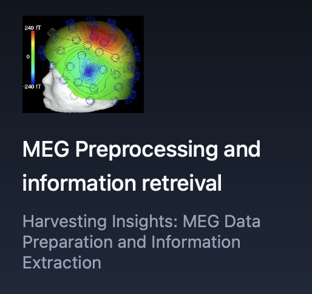

# MEG Preprocessing and Information Retrieval



**Harvesting Insights: MEG Data Preparation and Information Extraction**

Build an end-to-end MEG pipeline: clean raw sensor data, then extract cognitively meaningful information (evoked responses, spectral features, or simple decoding).

## Why this project

MEG has excellent temporal resolution and cleaner physics than EEG for source-level thinking. A solid preprocess → feature/info extraction demo shows you can handle clinical-grade neuroimaging workflows, not only consumer EEG.

## Dataset (starter options)

- [MNE sample dataset](https://mne.tools/stable/documentation/datasets.html) — tiny, ships with MNE; fastest path to a working v1
- [OpenNeuro MEG datasets](https://openneuro.org/) (e.g. auditory / visual oddball) — portfolio-scale follow-on
- Optional later: Cam-CAN or Human Connectome Project MEG subsets

## Suggested stack

- Python, MNE-Python, NumPy, SciPy, Matplotlib
- Optional: scikit-learn for simple decoding after preprocessing

## Pipeline focus

1. **Preprocessing** — bad channel detection, filtering, notch, ICA / SSP for artifacts, epoching, baseline correction
2. **Information retrieval** — evoked averages, time-frequency (TFR), sensor-space topo / field maps (fT scale), optional MVPA decode of condition

## Milestones

1. Load sample MEG; plot raw + magnetometer / gradiometer field map
2. Filter + artifact cleaning; compare before/after PSD and topo
3. Epoch by condition; plot evoked responses and topo at peak latency
4. Extract features (peak amp, bandpower, or vectorized epochs) and decode two conditions
5. Portfolio figure: field map + cleaning summary + decoding accuracy

## Layout (once you start coding)

```
notebooks/   # exploration
src/         # preprocess + feature helpers
data/        # local MEG (gitignored)
figures/     # portfolio plots
```
